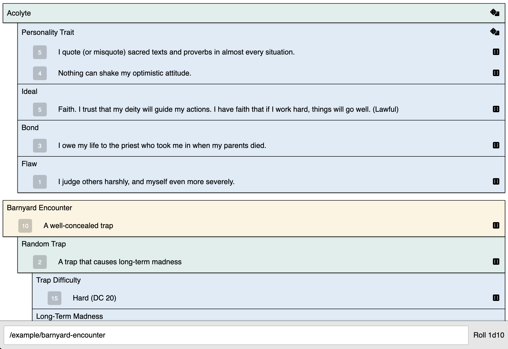

## About

## Getting started

- Build the rollables index and YAML files into `client/dist`: `cd server && npm run build:static`
- Build the client app and start the web server: `cd client && npm run serve`

## Future improvements

- (`server` + `client`) support dynamic indexing of rollables (for dev) alongside building a static index (for production)
- (`server`) configurable rollables source directory (e.g. switch between included SRD vs. private rollables repository)
